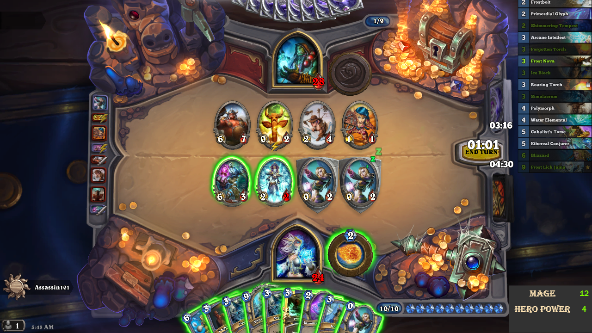
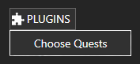
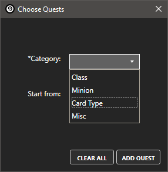
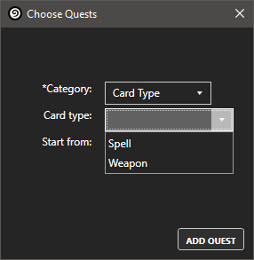

Hearthstone Quest Tracker
========================
This is a plugin for [Hearthstone Deck Tracker](https://github.com/Epix37/Hearthstone-Deck-Tracker)

Hearthstone does not track Daily Quests from within a match. This plugin attempts to fix that. Useful for when you play to complete quests (which I do often).

This plugin does this by allowing you to set and keep track of progress in your daily quests by tracking played cards.
  
  
## Features

Keeps track of the following quests (currently)
- Class quests: Play X "Class" cards
  - Supports all classes (Druid, Hunter, Mage, Paladin, Priest, Shaman, Rogue, Warlock, Warrior)
  - Supports Tri-class cards
- Minion quests
  - Play Tribe cards (Beasts, Demons, Murlocs, Pirates, Elementals)
  - Play Minion Mechanic cards (Battlecry, Deathrattle, Divine Sield, Enrage, Taunt)
- Card Type quests
  - Play Spells
  - Play Weapons
- Miscellaneous quests
  - Use Hero Power X times
  - Play X minions that cost 2 or less
  - Play X minions that cost 5 or more
  
__Note:__ This list will expand as I add support for the rest of play quests.  
Current completion: 24/30 quests (80% support)
  
  
## Installation
- Download *HQT.zip* from [here](https://github.com/PyroGenesis/Hearthstone-Quest-Tracker/releases).
- If needed, unblock the zip file before unzipping, by [right-clicking it and choosing properties](http://blogs.msdn.com/b/delay/p/unblockingdownloadedfile.aspx)
#### Drag and Drop method
1. Open `Options -> Tracker -> Plugins`
1. Drag the downloaded *HQT.zip* into the plugins window
1. (Re-)start HDT
1. Enable the plugin in `Options -> Tracker -> Plugins`.
#### Manual
1. Open `Options -> Tracker -> Plugins -> Plugins Folder.`
1. Extract *HQT.zip* into the folder.
1. (Re-)start HDT.
1. Enable the plugin in `Options -> Tracker -> Plugins`.
  
  
## How to use
1. Use the *Chosse Quests* option in HDT's plugin menu to open the quest selection window.

2. Choose the category of the quest that you want to track using the drop-down menu.

3. Next, choose the quest to be tracked using the new dropdown menu.

3. Now click the *Add Quest* button to add it to the tracker then play any match and the tracker will be displayed.

## Feedback
Currently this tracker is active in all game modes as it is still under development.

I will try to make/keep this plugin functional to the best of my ability. I am very new to C# development so any improvements or suggestions are welcome.

Use the [Issue tracker](https://github.com/PyroGenesis/Hearthstone-Quest-Tracker/issues/new) to send feedback
