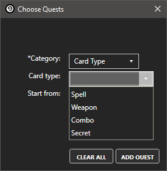

Hearthstone Quest Tracker
========================
This is a plugin for [Hearthstone Deck Tracker](https://github.com/Epix37/Hearthstone-Deck-Tracker)

Hearthstone has a lot of daily play quests, many of which warrant their own decks. However, there is no way to know the progress of these quests while playing a match.

This plugin attempts to solve this problem by allowing you to set and keep track of progress in your daily quests by tracking played cards.
  
  
## Features

Keeps track of the following quests (currently)
- Class quests
  - Play X Druid cards
  - Play X Hunter cards
  - Play X Mage cards
  - Play X Paladin cards
  - Play X Priest cards
  - Play X Shaman cards
  - Play X Rogue cards
  - Play X Warlock cards
  - Play X Warrior cards
- Miscellaneous quests
  - Use Hero Power X times
  
Note: This list will expand as I add support for the rest of play quests.
  
  
## Installation
- Download *HQT.zip* from [here](https://github.com/PyroGenesis/Hearthstone-Quest-Tracker/releases).
- If needed, unblock the zip file before unzipping, by [right-clicking it and choosing properties](http://blogs.msdn.com/b/delay/p/unblockingdownloadedfile.aspx)
#### Drag and Drop method
1. Open `Options -> Tracker -> Plugins`
1. Drag the downloaded *HQT.zip* into the plugins window
1. (Re-)start HDT
1. Enable the plugin in `Options -> Tracker -> Plugins`.
#### Manual
1. Open `Options -> Tracker -> Plugins -> Plugins Folder.`
1. Extract *HQT.zip* into the folder.
1. (Re-)start HDT.
1. Enable the plugin in `Options -> Tracker -> Plugins`.
  
  
## How to use
1. Use the *Chosse Quests* option in HDT's plugin menu to open the quest selection window.

2. Choose the quest that you want to track using the drop-down menus and click the *Add Quest* button to add it to the tracker

3. Now play any match and the tracker overlay will be displayed

## Feedback
I will try to make/keep this plugin functional to the best of my ability. I am very new to C# development so any improvements or suggestions are welcome.

Use the [Issue tracker](https://github.com/PyroGenesis/Hearthstone-Quest-Tracker/issues/new) to send feedback
